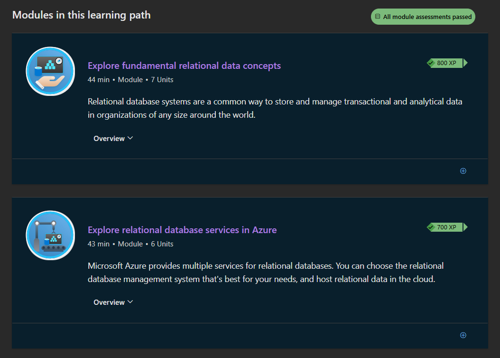

# Bootcamp Portfolio
## Microsoft Azure and Fabric - Data Fundamentals

This workbook showcases my progress and applied learning during the Data Technician training program.

---

### 🎯 Purpose of the Document
This workbook is a **Work In Progress (WIP)** completed as part of my **Data Technician training program - Week 5**, focusing on **Microsoft Azure Data Fundamentals (DP-900)** and **Microsoft Fabric**.  
It explores how cloud platforms like Azure and Fabric enable modern data storage, transformation, and analytics at scale.  
The workbook combines theoretical knowledge, practical lab exercises, and a real-world business case (“Paws & Whiskers”) to develop a strong understanding of **cloud-based data ecosystems, compliance, and business intelligence solutions**.

---

## 🧠 Key Skills
- **Cloud Computing Foundations** - Understanding cloud models (IaaS, PaaS, SaaS) and deployment types (Public, Private, Hybrid).  
- **Data Strategy & Architecture** - Designing and implementing scalable, secure, and efficient data solutions in Azure and Microsoft Fabric.  
- **Modern Data Analytics** - Integrating structured, semi-structured, and unstructured data across Azure and Fabric environments.  
- **Compliance & Data Governance** - Applying UK and EU data laws such as GDPR and the Data Protection Act 2018 within cloud infrastructures.  
- **Data Integration & Automation** - Streamlining data movement and transformation using **Azure Data Factory** and **Fabric Data Pipelines**.  
- **Collaborative Problem Solving** - Working in teams to complete Azure labs and group activities, applying theoretical knowledge to practical tasks.  
- **Business Solution Design** - Translating client needs into technical recommendations, as demonstrated in the **“Paws & Whiskers” cloud transformation scenario**.

---

## 💻 Technical Skills
- **Cloud Computing Concepts**
  - *IaaS* - Virtualized infrastructure for hosting applications and services.  
  - *PaaS* - Managed environments for database and analytics solutions.  
  - *SaaS* - Cloud-based applications like Microsoft 365 and Power BI.  

- **Microsoft Azure Services**
  - **Azure SQL Database** - Managed relational database service.  
  - **Azure Cosmos DB** - NoSQL database for non-relational data.  
  - **Azure Synapse Analytics** - Scalable analytics and data warehousing.  
  - **Azure Data Factory** - ETL and data integration pipelines.  
  - **Azure Blob Storage** - Storage for large, unstructured data files.  
  - **Azure Machine Learning** - Predictive modeling and AI integration.  
  - **Azure Backup & Site Recovery** - Business continuity and disaster recovery solutions.  

- **Microsoft Fabric Capabilities**
  - **OneLake** - Unified data lake for all Fabric workloads.  
  - **Data Factory (Fabric)** - Low-code/no-code data pipeline design for ingestion and transformation.  
  - **Synapse (Fabric)** - Integrated analytics engine for querying and reporting.  
  - **Power BI Integration** - Real-time dashboards for unified visualization and reporting.  
  - **Data Activator** - Event-driven automation for data alerts and triggers.  
  - **Fabric Capacity** - Understanding resource management and scalability within Fabric environments.  

- **Azure & Fabric Labs Completed (WIP)**
  - **Lab 3: Explore Relational Data in Azure**  
    Hands-on experience with Azure SQL Database to store and query relational data.  
  - **Lab 4: Explore Non-Relational Data in Azure**  
    Practical exploration of Azure Cosmos DB for unstructured and document-based data.  
  - **Lab 5: Explore Data Analytics in Azure**  
    Developed analytics workflows using Azure Synapse Analytics and Data Factory.  
  - **Microsoft Fabric Exploration**  
    Configured and explored Microsoft Fabric components including OneLake, Synapse, and Power BI integration to understand end-to-end cloud analytics.

- **Security & Governance**
  - Role-Based Access Control (RBAC)  
  - Data encryption (in transit and at rest)  
  - GDPR & DPA compliance in data storage and processing  
  - Data classification and retention strategies  

---

### 📂 File Overview
- `Saharsh_Data_Technician_Workbook_Week_5.docx` - **(Work In Progress)** workbook containing Azure and Fabric labs, theoretical research, and a case study on designing a cloud-based data solution for a retail business.

---

### 🧾 Summary
This ongoing workbook showcases my development in **cloud data architecture, analytics, and governance** using **Microsoft Azure** and **Microsoft Fabric**.  
It demonstrates an understanding of both **relational and non-relational data systems**, **data pipelines**, and **real-time analytics**.  
By combining cloud computing concepts with hands-on labs, I’ve gained experience in designing **secure, scalable, and insight-driven data platforms** suitable for modern business environments.

---

### 👤 Author
**Saharsh Jakkula**  
📅 *Course Date:* 08/09/2025  
📧 *Contact:* https://www.linkedin.com/in/saharsh-j-17073432b/
