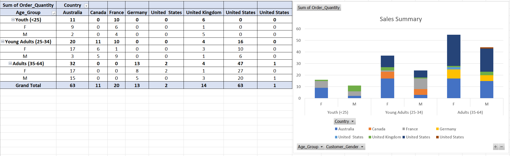

# Bootcamp Portfolio
## Microsoft Excel - Data Processing and Data Visualization

This workbook showcases my progress and applied learning during the Data Technician training program.

---

# 📘 Data Technician Workbook - Week 1

### 🎯 Purpose of the Document
This workbook was developed as part of my **Data Technician training program** to demonstrate practical data handling, analysis, and visualization skills.  
It includes hands-on exercises that simulate real-world data management scenarios using **Microsoft Excel**, showcasing my ability to clean, process, analyze, and present data effectively.  
The project emphasizes best practices in **data integrity, visualization, and automation**.

---

## 🧠 Key Skills
- **Data Analysis & Interpretation** - Translating raw data into actionable insights.  
- **Data Quality Management** - Ensuring accuracy, consistency, and security in datasets.  
- **Problem Solving** - Using analytical thinking to uncover trends and support decisions.  
- **Data Visualization** - Presenting complex data clearly through visual tools and dashboards.  
- **Process Optimization** - Automating repetitive workflows for improved efficiency.  
- **Reporting & Communication** - Delivering clear, data-driven insights for technical and non-technical audiences.

---

## 💻 Technical Skills
- **Data Cleaning** - Removing duplicates, correcting formats, and standardizing datasets.  
- **Formulas & Functions** - Skilled in `SUM`, `AVERAGE`, `IF`, `SWITCH`, `VLOOKUP`, and `XLOOKUP`.  
- **Cell Referencing** - Using absolute and relative references for accurate calculations.  
- **Data Ranges & Tables** - Creating structured data tables for efficient analysis.  
- **Pivot Tables** - Summarizing and analyzing large datasets for insights.  
- **Visualization Tools** - Building charts, graphs, and dashboards to communicate findings.  
- **Data Validation & Protection** - Implementing controls for data accuracy and integrity.  
- **Conditional Formatting** - Highlighting patterns, trends, and outliers.  
- **Filters, Sorting & Slicers** - Enhancing interactivity and data exploration.  
- **Forecasting & What-If Analysis** - Modeling scenarios and predicting outcomes.  
- **Macros & Task Automation** - Streamlining workflows through Excel macros and automation techniques.

---

### 📂 File Overview
- `Saharsh_Jakkula_Data_Workbook_Week_1.docx` - Complete workbook containing all exercises, datasets, and applied tasks.

---

### 🧾 Summary
This project demonstrates my foundational understanding of **data analysis**, **Excel-based automation**, and **data-driven storytelling** - essential skills for any data professional.

---

### 👤 Author
**Saharsh Jakkula**  
📅 *Course Date:* 08/09/2025  
📧 *Contact:* https://www.linkedin.com/in/saharsh-j-17073432b/
