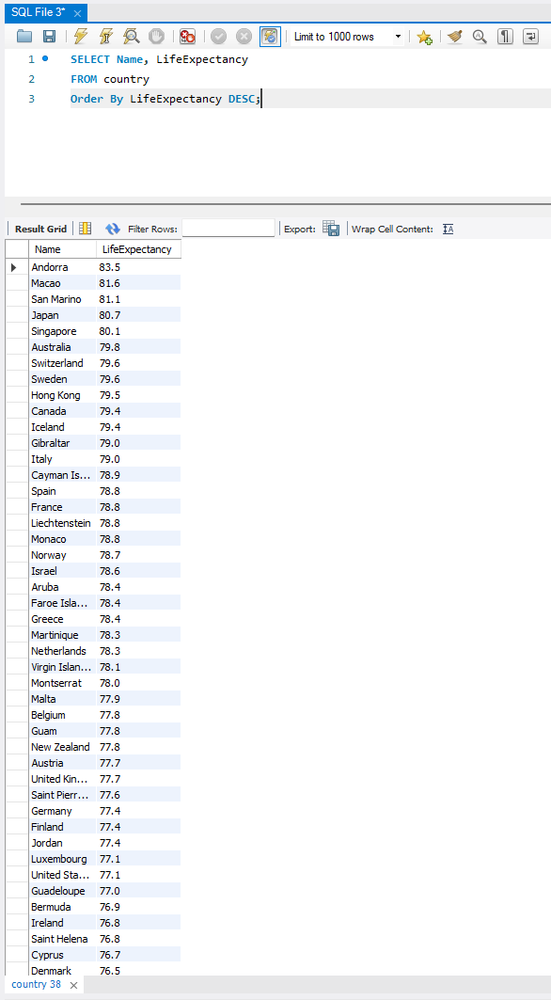

# Bootcamp Portfolio
## MySQL - Relational Databases and Structured Query Language

This workbook showcases my progress and applied learning during the Data Technician training program.

# 📘 Data Technician Workbook - Week 3 (WIP)

### 🎯 Purpose of the Document
This workbook is a **Work In Progress (WIP)** created as part of my **Data Technician training program – Week 3**, focusing on **relational databases, SQL fundamentals, and data modeling**.  
It demonstrates my ongoing development in designing and managing databases using **MySQL** and **Microsoft Access**, while applying real-world business scenarios to structure and query relational data effectively.  
This week’s work expands on earlier data analysis skills by introducing the principles of **database architecture, normalization, and query optimization**.

---

## 🧠 Key Skills
- **Database Design & Planning** - Developing logical and physical models for storing structured data.  
- **Relational Thinking** - Understanding and applying one-to-one, one-to-many, and many-to-many relationships.  
- **Data Modeling** - Translating business operations into normalized database schemas.  
- **Data Integrity & Accuracy** - Implementing keys and constraints to maintain consistent and valid records.  
- **Problem Solving** - Using SQL to address real-world use cases like retail inventory, sales, and customer data management.  
- **Analytical Querying** - Writing queries to analyze, filter, and aggregate meaningful insights from data.  
- **Collaboration & Reflection** - Working with peers on SQL practical tasks and refining database concepts through shared learning.  

---

## 💻 Technical Skills
- **Relational Database Concepts** - Applying **primary keys**, **foreign keys**, and relational dependencies.  
- **SQL Query Writing** - Practicing `SELECT`, `INSERT`, `UPDATE`, `DELETE`, and `CREATE TABLE` commands.  
- **JOIN Operations** - Using `INNER JOIN`, `LEFT JOIN`, `RIGHT JOIN`, `FULL JOIN`, `CROSS JOIN`, and `SELF JOIN`.  
- **Schema Design** - Defining tables, fields, and data types to reflect real-world entities and relationships.  
- **Normalization** - Reducing redundancy and improving data efficiency through structured table relationships.  
- **Aggregation & Filtering** - Using `COUNT()`, `AVG()`, `SUM()`, `WHERE`, and `GROUP BY` for data summaries.  
- **Star Schema Implementation** - Using fact and dimension tables for simplified analytical querying.  
- **Data Definition Language (DDL)** - Creating and modifying database structures.  
- **Data Manipulation Language (DML)** - Managing and maintaining data integrity through updates and inserts.  
- **Scenario-Based SQL Queries** - Solving tasks using the `world_db` dataset (e.g., demographic analysis, population queries).  
- **Backup & Access Control** - Understanding data security, user roles, and database maintenance essentials.  

---

### 📂 File Overview
- `Data_Technician_Workbook_Week_3.docx` - **(Work In Progress)** Workbook covering relational database theory, schema design, and SQL practical exercises.

---

### 🧾 Summary
This ongoing workbook represents my progression into **relational database management and SQL development**.  
Through both theoretical and applied exercises, I’m developing the ability to **design normalized databases**, **write optimized SQL queries**, and **analyze structured data** effectively.  
As this work continues, I’ll refine my SQL syntax, join logic, and database design capabilities to further strengthen my skills in data architecture and back-end analytics.

---

### 👤 Author
**Saharsh Jakkula**  
📅 *Course Date:* 08/09/2025]
📧 *Contact:* https://www.linkedin.com/in/saharsh-j-17073432b/
