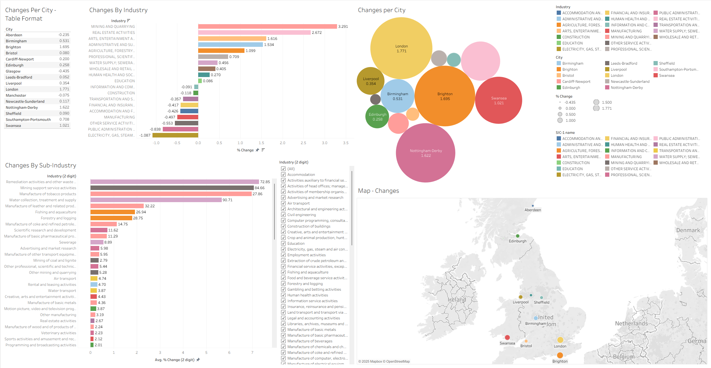

# Bootcamp Portfolio
## Microsoft Excel - Data Processing and Data Visualization

This workbook showcases my progress and applied learning during the Data Technician training program.

# 📘 Data Technician Workbook – Week 2 (WIP)

### 🎯 Purpose of the Document
This workbook is a **Work In Progress (WIP)** created as part of my *Data Technician training program – Week 2*, focused on **data visualization and dashboard development** using **Tableau** and **Microsoft Power BI**.  
It demonstrates my growing proficiency in designing interactive dashboards, interpreting datasets, and applying visualization best practices for clear and data-driven storytelling.  
This workbook builds on my Week 1 Excel foundations by exploring **data analytics through visual intelligence** and **business reporting tools**.

---

## 🧠 Key Skills
- **Data Visualization & Storytelling** – Designing interactive dashboards that communicate insights effectively.  
- **Analytical Thinking** – Identifying trends and patterns in datasets to support decision-making.  
- **Business Intelligence (BI) Reporting** – Creating visual reports to aid strategic understanding.  
- **Data Preparation** – Cleaning, transforming, and blending data from multiple sources for visualization.  
- **Dashboard Design Principles** – Building user-friendly and visually consistent dashboards.  
- **Comparative Analysis** – Evaluating Tableau and Power BI functionality and performance.  
- **Collaboration & Feedback** – Sharing dashboards and responding to class feedback constructively.  

---

## 💻 Technical Skills
- **Tableau Public & Tableau Desktop** – Data visualization, dashboard creation, and geographic mapping.  
- **Power BI Desktop** – Data importation, transformation, report design, and dashboard publishing.  
- **Data Modeling** – Structuring datasets for accurate relationships and visual representation.  
- **Calculated Fields & Measures** – Applying custom logic for KPIs and advanced metrics.  
- **Data Connections** – Integrating CSV, Excel, and API-based datasets into BI tools.  
- **Interactive Visuals** – Implementing filters, slicers, and tooltips for better usability.  
- **Geo-Visualization** – Mapping regional data insights with location-based metrics.  
- **Trend & Comparative Analysis** – Tracking performance indicators across time and categories.  
- **Formatting & Design** – Enhancing readability through consistent color palettes and layout structure.  
- **Publishing & Sharing** – Exporting and sharing dashboards via Tableau Public and Power BI Service.  

---

### 📂 File Overview
- `Saharsh_Jakkula_Data_Workbook_Week_2.docx` – **(Work In Progress)** Workbook containing Tableau and Power BI visualization exercises, labs, and reflections.

---

### 🧾 Summary
This ongoing project highlights my transition from **data manipulation in Excel** to **data visualization in Tableau and Power BI**.  
It represents a key stage in developing my skills in **business intelligence**, **interactive reporting**, and **data storytelling** — essential for presenting analytical insights clearly and impactfully.

---

### 👤 Author
**Saharsh Jakkula**  
📅 *Course Date:* 15/09/2025  
📧 *Contact:* https://www.linkedin.com/in/saharsh-j-17073432b/
